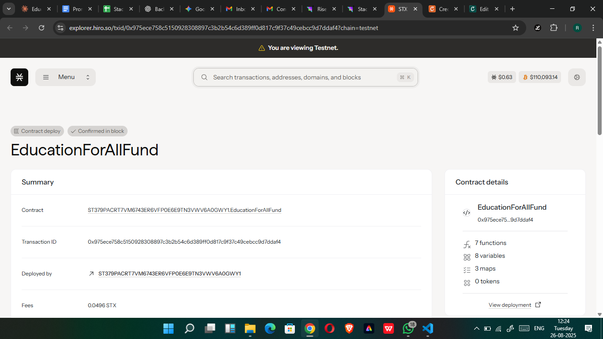

# EducationForAll Fund

## Project Description

The EducationForAll Fund is a blockchain-based decentralized platform designed to democratize access to education in underserved communities worldwide. Built on the Stacks blockchain using Clarity smart contracts, this platform enables transparent, traceable donations while providing comprehensive outcome measurement and impact tracking.

Our platform connects global donors directly with local education programs, ensuring funds reach their intended beneficiaries while maintaining complete transparency throughout the process. Every donation is recorded on the blockchain, and program outcomes are regularly updated to demonstrate real-world impact.

## Project Vision

**"Bridging the global education gap through blockchain transparency and community empowerment."**

We envision a world where:
- **Every child has access to quality education**, regardless of their geographic location or economic background
- **Donors can see the direct impact** of their contributions through transparent, real-time outcome tracking
- **Local communities are empowered** to create and manage their own education programs
- **Blockchain technology eliminates intermediaries**, ensuring maximum fund utilization for educational purposes
- **Global collaboration** creates sustainable education ecosystems in underserved areas

Our mission is to leverage decentralized technology to create lasting educational change, fostering a more equitable world where knowledge and opportunity are accessible to all.

## Future Scope

### Phase 1: Platform Enhancement
- **Multi-Currency Support**: Accept donations in various cryptocurrencies and stablecoins
- **Mobile Application**: Develop user-friendly mobile apps for donors and program managers
- **Advanced Analytics Dashboard**: Real-time visualization of program performance and impact metrics
- **Automated Fund Distribution**: Smart contract-based milestone funding based on outcome achievements

### Phase 2: Ecosystem Expansion
- **Partnership Integration**: Connect with NGOs, educational institutions, and government programs
- **Marketplace Features**: Allow educators to list courses, materials, and services
- **Peer-to-Peer Learning**: Enable direct connections between students and volunteer teachers globally
- **Certification System**: Blockchain-verified educational credentials and skill certificates

### Phase 3: Advanced Features
- **AI-Powered Matching**: Intelligent pairing of donors with programs based on preferences and impact potential
- **Micro-Learning Modules**: Bite-sized educational content delivery system
- **Community Governance**: DAO-based decision making for platform direction and fund allocation
- **Carbon Offset Integration**: Environmental impact tracking for sustainable education initiatives

### Phase 4: Global Impact
- **Multi-Chain Deployment**: Expand to other blockchain networks for broader accessibility
- **Government Integration**: Work with national education ministries for policy alignment
- **Corporate CSR Programs**: Enterprise-level donation and impact tracking solutions
- **Research & Development**: Academic partnerships for continuous platform improvement

### Long-term Goals
- **1 Million Students Reached** by 2030
- **Global Network of 10,000+ Education Programs**
- **$100 Million in Transparent Educational Funding**
- **50+ Country Presence** with localized program support
- **Industry Standard** for blockchain-based educational philanthropy

## Contract Address Details

Contract Id:ST379PACRT7VM6743ER6VFP0E6E9TN3VWV6A0GWY1.EducationForAllFundP

### Mainnet Deployment
- **Contract Address**: 
- **Contract Name**: education-for-all-fund
- **Deployer**: 
- **Deployment Block**: 
- **Deployment Date**: 

### Testnet Deployment
- **Contract Address**: 
- **Contract Name**: education-for-all-fund-testnet
- **Network**: Stacks Testnet
- **Explorer Link**: 

### Contract Verification
- **Source Code**: Verified and open source
- **Audit Status**: [To be updated after security audit]
- **License**: MIT License

---

## Technical Overview

### Key Functions

1. **`donate-to-program`**: Enables transparent donations to specific education programs with automatic token minting as donation receipts
2. **`update-program-outcomes`**: Allows authorized parties to update program performance metrics and outcomes

### Smart Contract Features

- **Transparent Fund Tracking**: All donations and fund movements recorded on-chain
- **Outcome Measurement**: Comprehensive tracking of educational impact metrics
- **Token Economics**: EDU tokens minted as donation receipts and proof of contribution
- **Access Control**: Role-based permissions for program management and outcome updates
- **Event Logging**: Detailed blockchain events for audit trails and transparency

### Getting Started

1. **For Donors**: Connect your Stacks wallet and browse available education programs
2. **For Program Creators**: Submit program proposals and provide regular outcome updates
3. **For Beneficiaries**: Access funded educational resources and report progress

### Community

- **Website**:
- **Documentation**: 
- **Discord**: 
- **Twitter**: 
- **GitHub**: [Repository link]

---

